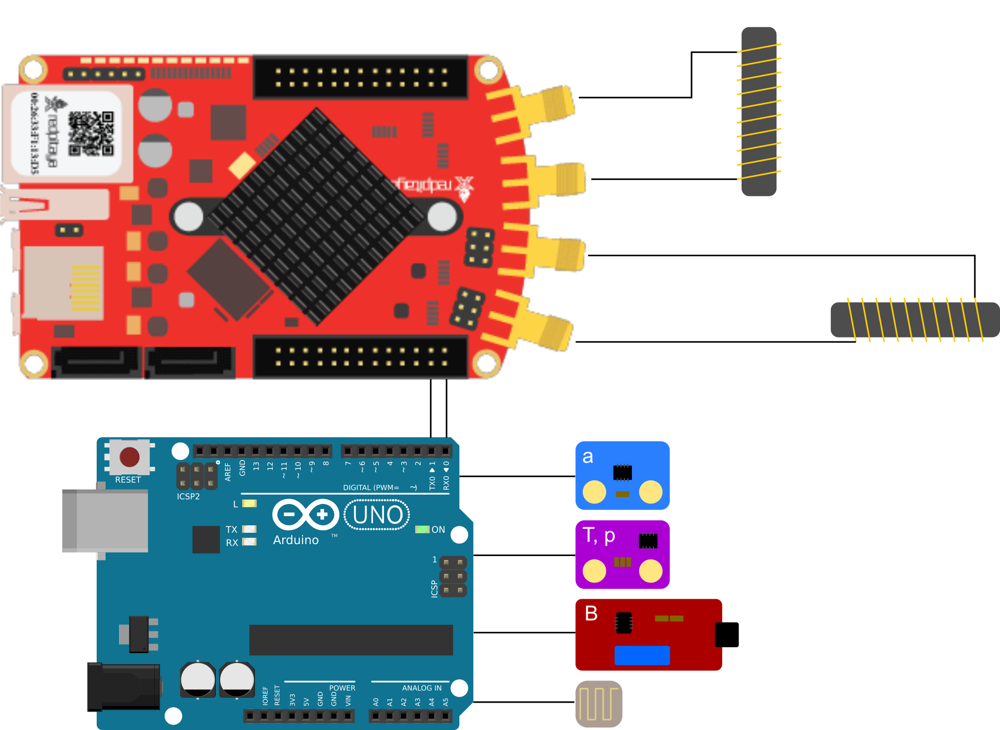

# Open Haloscope
 An open source axion dark matter experiment, for real.
 
 Axions are an hypothetical particles which extend the Standard Model of particle physics and, if they exist, form dark matter.
 The search for axions is performed with earth-based experiments called haloscopes from the dark matter halo of the Milky Way.
 To build an haloscope, one normally needs a partcile physics laboratory, a team of physicists and engineers, and a some million euros.
 
 This project implements a fermionic axion interferometer based on the axion-spin interaction. Conversely to usual haloscopes, it can be built by anybody, in a garage, and at a cost of a two to three hundred euros. A complete experimental setup allows for characterisation measurements, data acquisition and processing, data analysis, and eventually leads to investigating the existance of dark matter axions. In case this is not enough, this same experiment is most likely sensitive to gravitational waves as well.
 
 For more detailed information, building instructions and so on, please refer to the wiki of the project.
 
 ---
 
 ### The experiment
  The physical phenomenon which is sensitive to the presence of dark matter is a magnetic resonance, and in particular its frequency.
  In a few words, the experiments monitors the MHz-frequency resonances of two perpendicular [ferrimagnetic rods](https://fr.rs-online.com/web/p/noyaux-de-ferrites/4673983), using a [Red Pitaya](https://redpitaya.readthedocs.io/en/latest/index.html) board. In addition, several other physical parameters are measured with the aid of an [Arduino](https://www.arduino.cc/) and some sensors.
  

The experiment is operated using [Jupyter notebooks](https://jupyter.org/), data acquisition and storage is handled using [QCodes](https://qcodes.github.io/), and the data analysis is performed in notebooks as well. 
This repository provides the tools to compare the measurements to the expected effects of an axionic dark matter field, therefore allowing to detect or exclude the presence of dark matter.

To summarise the results of an experimental run, astroparticle physicists like to use exclusion plots which show which part of the axion phase space they just ruled out. Even if reductive, this is somehow the aim of an haloscope, and therefore here is the exclusion plot resulting from the first run of the haloscope named Kakapo[^1], performed in Grenoble (France) in the spring of 2023.

This setup works, but can be havily modified and improved, for example by using different hardware or working on the software side side to advance the data analysis. The space for user creativity is wide, and hopefully it can be a fertile ground for ideas.

[^1]: Named after a [flightless bird](https://en.wikipedia.org/wiki/Flightless_bird).
